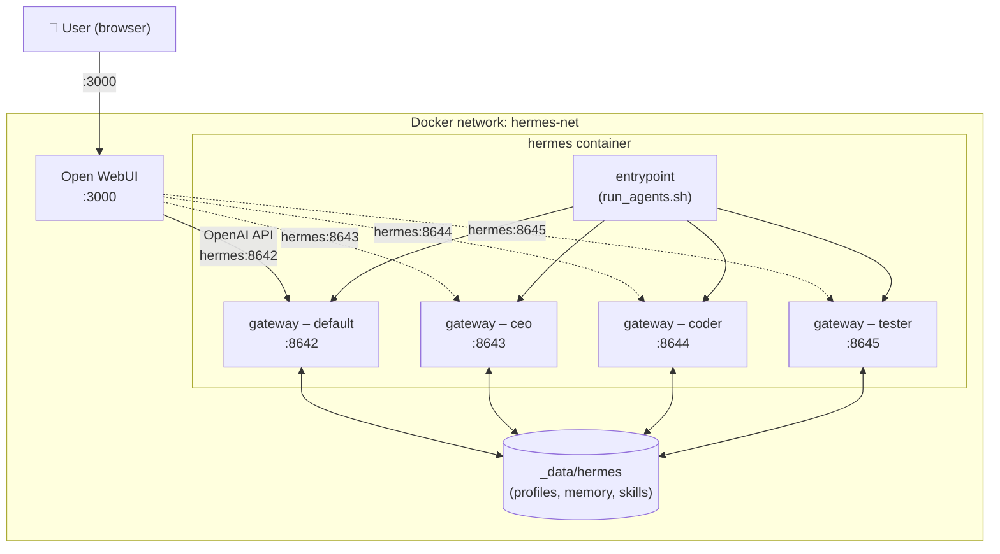

# hermes-multi-agent

> Run multiple isolated [Hermes Agent](https://github.com/NousResearch/hermes-agent) instances — each with its own config, memory, skills, and API endpoint — from a single `docker compose up`.

Define your agent fleet in one YAML file. The custom entrypoint handles profile creation, dependency ordering, `.env` injection, and auto-restarting gateways automatically on every startup.

```
$ docker compose exec hermes hermes profile list

 Profile    Gateway    Port
 ────────   ────────   ─────
 default    running    8642
 ceo        running    8643
 coder      running    8644
 tester     running    8645
```

---

## Features

- **Declarative agent fleet** — define every agent in `etc/agents.yml`; no code changes needed to add, remove, or reconfigure agents
- **Profile cloning** — bootstrap new agents from an existing profile (config, API keys, skills, personality) with `clone-from`
- **Dependency-aware ordering** — profiles cloned from other managed profiles are created in the correct topological order, even across chains (A → B → C)
- **Idempotent startup** — existing profiles are left untouched on restart; only new entries trigger `hermes profile create`
- **Per-profile `.env` injection** — `API_SERVER_PORT`, `API_SERVER_KEY`, and any extra vars are merged into each profile's `.env` on every start
- **Auto-restarting gateways** — each active profile's gateway restarts automatically (5 s back-off) if it crashes
- **Open WebUI ready** — every agent appears as a distinct model in [Open WebUI](https://github.com/open-webui/open-webui), selectable from the model dropdown

---

## Architecture



> Solid arrow = default Open WebUI connection. Dashed arrows = optional additional connections you add per agent.

---

## Quick Start

### Prerequisites

- [Docker](https://docs.docker.com/get-docker/) with Compose v2
- At least one LLM provider API key (Anthropic, OpenAI, DeepSeek, …)

### 1 — Clone the repository

```bash
git clone https://github.com/your-username/hermes-multi-agent.git
cd hermes-multi-agent
```

### 2 — Set your API keys

Create a `.env` file at the project root:

```bash
cp .env.example .env   # if provided, or create manually
```

```dotenv
# .env
DEEPSEEK_API_KEY=sk-…
# ANTHROPIC_API_KEY=sk-ant-…
# OPENAI_API_KEY=sk-…
```

### 3 — Define your agents

Edit `etc/agents.yml` (see [Configuration](#configuration) below). The default file ships with three example agents to get you started.

### 4 — Start the stack

```bash
docker compose up -d
```

Open WebUI will be available at **http://localhost:3000**.

---

## Configuration

### `etc/agents.yml`

Each top-level key is a Hermes profile name. The entrypoint processes them in dependency order automatically.

```yaml
# Profile name (becomes the model ID in Open WebUI)
ceo:
  active: true           # true = create profile (if needed) and start its gateway
  clone-from: default    # clone config/skills from this profile; false = blank profile
  env:
    API_SERVER_PORT: 8643          # unique port for this agent's API server
    API_SERVER_KEY:  sk-preflow        # bearer token (min 8 chars)

coder:
  active: true
  clone-from: false      # start completely fresh with bundled skills
  env:
    API_SERVER_PORT: 8644
    API_SERVER_KEY:  sk-coder

tester:
  active: true
  clone-from: coder      # inherits coder's config — created after coder automatically
  env:
    API_SERVER_PORT: 8645
    API_SERVER_KEY:  sk-tester
```

| Field | Type | Description |
|---|---|---|
| `active` | bool | Whether to start this profile's gateway on startup |
| `clone-from` | string \| false | Source profile to clone from, or `false` for a blank profile |
| `env.API_SERVER_PORT` | int | Unique port for this agent's OpenAI-compatible API |
| `env.API_SERVER_KEY` | string | Bearer token for the API (≥ 8 characters) |
| `env.*` | string | Any additional env var written to the profile's `.env` |

> `API_SERVER_ENABLED=true` and `API_SERVER_HOST=0.0.0.0` are always injected automatically — you don't need to set them.

### `docker-compose.yml` environment

The top-level `hermes` service environment block configures the **default** profile gateway (port 8642). Set your LLM provider keys here and they will be available to all profiles.

```yaml
environment:
  DEEPSEEK_API_KEY: ${DEEPSEEK_API_KEY}
  API_SERVER_PORT:  8642
  API_SERVER_KEY:   sk-preflow
```

---

## Connecting agents in Open WebUI

By default Open WebUI connects to the **default** gateway at `http://hermes:8642/v1`. To expose additional agents as selectable models:

1. Go to **Settings → Admin → Connections → OpenAI API**
2. Add a new entry for each profile:

| Agent | API Base URL | API Key |
|---|---|---|
| ceo | `http://hermes:8643/v1` | `sk-preflow` |
| coder | `http://hermes:8644/v1` | `sk-coder` |
| tester | `http://hermes:8645/v1` | `sk-tester` |

Each agent then appears as its own model (`ceo`, `coder`, `tester`) in the model dropdown — fully isolated memory, skills, and personality.

---

## How it works

`etc/run_agents.sh` replaces the default container entrypoint and runs before handing off to the built-in `entrypoint.sh`:

```
Container start (root)
│
├─ Activate Python venv
│
├─ Parse etc/agents.yml
│   ├─ Topological sort: clone-from sources created before dependents
│   ├─ hermes profile create <name> [--clone --clone-from <src>]  (skipped if exists)
│   ├─ Merge .env:  existing ← static overrides ← agents.yml env vars
│   └─ chown -R hermes:hermes <profile_dir>   (fix permissions before gosu drop)
│
├─ For each active profile  (background, auto-restart loop):
│   └─ gosu hermes  hermes -p <name> gateway
│
└─ exec /opt/hermes/docker/entrypoint.sh  →  drops to hermes user  →  hermes gateway run
```

Any error during profile setup is **logged and skipped** — a bad entry in `agents.yml` will never prevent the container from starting.

---

## Project structure

```
hermes-multi-agent/
├── docker-compose.yml      # Stack definition (hermes + open-webui)
├── etc/
│   ├── agents.yml          # Agent fleet declaration
│   └── run_agents.sh       # Custom entrypoint: profile setup + gateway launcher
└── _data/                  # Persistent volumes (git-ignored)
    ├── hermes/             # Hermes profiles, memory, sessions, skills
    └── open-webui/         # Open WebUI database and uploads
```

---

## References

- [Hermes Agent docs](https://hermes-agent.nousresearch.com/docs)
- [Hermes profiles guide](https://hermes-agent.nousresearch.com/docs/user-guide/profiles)
- [Hermes API server](https://hermes-agent.nousresearch.com/docs/user-guide/features/api-server)
- [Open WebUI](https://github.com/open-webui/open-webui)
- [Docker Hub — nousresearch/hermes-agent](https://hub.docker.com/r/nousresearch/hermes-agent)

---

## License

[MIT](LICENSE)
